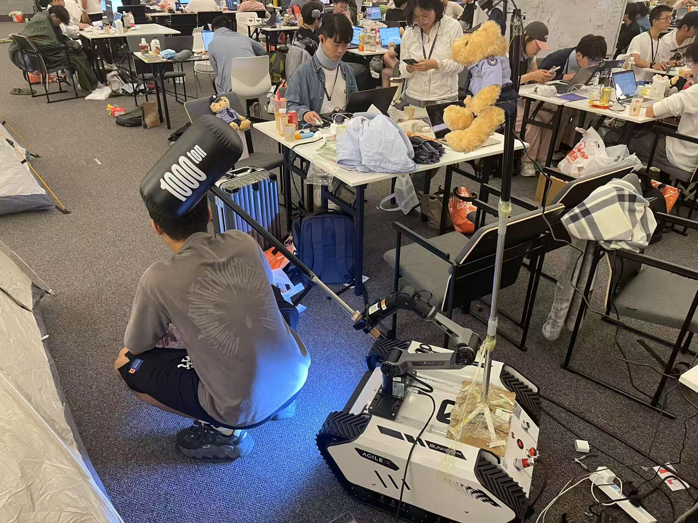
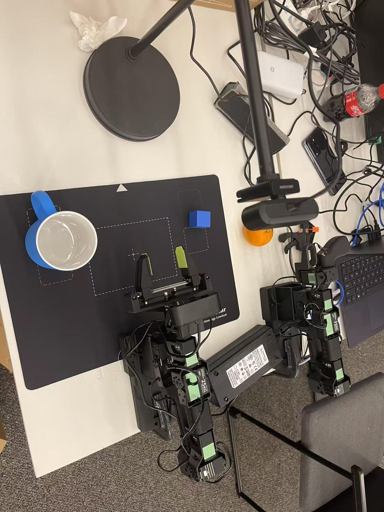

# Tong Tong Tong 机器人

本项目旨在开发一套基于视觉识别与控制的自动化系统，用以监管公共卫生行为（如随地大小便、不整理桌面等），以物理交互的方式提醒或干预违规行为。

---

## 📌 项目组成

### 1. 移动式巡检机器人（执法机器人）

该机器人搭载视觉系统和机械臂，能够在空间中巡逻并识别可疑行为者，对其挥动锤子进行“警示性驱赶”。



---

### 2. 桌面监管机器人

该机器人主要用于桌面管理，具备基本的感知和操作能力，例如将物体（如小木块）放入指定容器中。



---

## 🧰 硬件组成

### 移动式巡检机器人

| **设备类型** | **提供方**       | **型号/描述**           |
|--------------|------------------|--------------------------|
| 算力平台     | 地瓜机器人       | RDK X5 4G                |
| 移动底盘     | 松灵机器人       | BUNKER MINI              |
| 机械臂       | 松灵机器人       | PIPER                    |
| 摄像头       | Seeed Robotics   | 海康 USB 摄像头          |

---

### 桌面监管机器人

| **设备类型** | **提供方**       | **型号/描述**           |
|--------------|------------------|--------------------------|
| 算力平台     | Seeed Robotics   | Jetson Orin NX 16G       |
| 机械臂       | Seeed Robotics   | Start Arm                |
| 摄像头       | Seeed Robotics   | 海康 USB 摄像头          |

---

## 🚀 快速开始

### 环境配置

#### 1. 移动式巡检机器人

```bash
# 配置底盘（基于 ROS 2 Humble，Ubuntu 22.04）
参考：https://github.com/agilexrobotics/bunker_ros2/
将其克隆至：~/ros2_ws/src 并使用 colcon 编译

# 配置机械臂
参考：https://github.com/agilexrobotics/piper_sdk/
建议路径：~/projects/piper_sdk/

# CAN 通讯注意事项
由于地瓜板默认使用 can0，建议机械臂与底盘分别使用 can1 和 can2
```

#### 2. 桌面监管机器人

参考 [lerobot-starai/README.md](lerobot-starai/README.md) 完成环境依赖与配置。

---

### 启动步骤

#### 1. 启动移动巡检机器人

⚠️ 注意：**CAN 线请勿连接至拓展坞 USB 接口**

```bash
# 查询所有可用 CAN 接口
cd ~/projects/piper_sdk/piper_sdk/
bash find_all_can_port.sh

# 启动底盘控制（使用 can1）
cd ~/ros2_ws/
source install/setup.bash
cd src/ugv_sdk/scripts/
bash bringup_can2usb_500k.bash
ros2 launch bunker_base bunker_base.launch.py port_name:=can1

# 启动机械臂（使用 can2）
cd ~/projects/piper_sdk/piper_sdk/
bash can_activate.sh can2 1000000 1-1.4:1.0
```

> 启动成功后，可通过 `ifconfig` 查看 `can1` 与 `can2` 接口状态。

---

#### 2. 启动桌面监管机器人

请参考 [lerobot-starai/README.md](lerobot-starai/README.md) 完成：

- 数据采集  
- 模型训练  
- 推理部署  

---

## 📎 附录

如需进一步开发或复现，请确保安装正确版本的 ROS 2（推荐 Humble），并具备基本的 Jetson/Linux 使用经验。